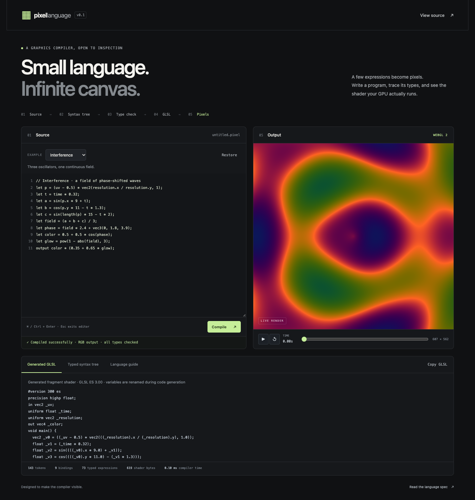

# Pixel Language

**A small typed language that turns mathematical expressions into live graphics.**

[Open the playground](https://elliottbarnes.github.io/pixel-language/) · [Browse the source](https://github.com/elliottbarnes/pixel-language)



Pixel Language implements a compiler front end in plain JavaScript: a lexer that records source locations, a precedence parser, a type checker, and a GLSL ES 3.00 code generator. A WebGL2 adapter compiles the generated shader and draws its result. The playground exposes the typed syntax tree and generated shader so you can follow an expression all the way to the GPU.

The language is intentionally small. It has scalar and vector math, immutable bindings, booleans, and conditional expressions. It has no loops or arbitrary shader pass-through. There are no runtime packages, framework, build step, account requirements, or external services. Edited source stays in browser memory and is not uploaded or saved across page reloads.

## Contents

- [Run locally](#run-locally)
- [Use the playground](#use-the-playground)
- [Worked example: a pulsing gradient](#worked-example-a-pulsing-gradient)
- [Language](#language)
  - [Program structure and names](#program-structure-and-names)
  - [Types and inputs](#types-and-inputs)
  - [Operators and precedence](#operators-and-precedence)
  - [Vectors and components](#vectors-and-components)
  - [Built-in functions](#built-in-functions)
  - [Grammar](#grammar)
- [Compiler architecture and API](#compiler-architecture-and-api)
- [Rendering, errors, and browser lifecycle](#rendering-errors-and-browser-lifecycle)
- [Limits and numerical behavior](#limits-and-numerical-behavior)
- [Tests and verification](#tests-and-verification)
- [Troubleshooting](#troubleshooting)
- [Extending and contributing](#extending-and-contributing)
- [License](#license)

## Run locally

You need Git to clone the repository, **Node.js 24 or later** to run tests, and **Python 3** to serve the playground. The browser needs JavaScript modules; rendering additionally requires WebGL2. The compiler itself can run in Node without a GPU.

```sh
git clone https://github.com/elliottbarnes/pixel-language.git
cd pixel-language
node --version
python3 --version
npm test
npm run serve
```

Open **http://localhost:8080**. Stop the server with Ctrl+C. There are no packages to install, so `npm install` is unnecessary.

The commands are wrappers for:

```sh
node --test
python3 -m http.server 8080 --directory docs
```

To bind a preview only to your own machine, use:

```sh
python3 -m http.server 8080 --bind 127.0.0.1 --directory docs
```

If port 8080 is already in use, choose another port such as 8081 and open its corresponding URL. Serve `docs/` over HTTP; double-clicking `index.html` is not a supported way to load browser modules. The folder contains the complete static app and uses relative asset URLs, so it also works below a repository path on a static host.

## Use the playground

Start with an example, then make one small change:

| Example | What it demonstrates | First change to try |
|---|---|---|
| **Interference** | Sine/cosine fields and a phase-shifted color palette | Change a frequency such as `p.x * 9` |
| **Orbital** | Circles defined by distance, smooth edges, and animation | Change the orbit radius from `0.29` |
| **Contours** | Nested waves, fractional bands, and color interpolation | Change the number of bands in `terrain * 3` |
| **Tessellation** | Repeated cells, local coordinates, and a diamond distance | Change the grid size in `vec2(8, 8)` |

Edits compile after a 650 ms pause. **Compile** or Command/Ctrl+Enter runs compilation immediately. The selected example and **Restore** replace the editor contents and reset time to zero; copy out edits you want to keep first.

The playback controls pause/resume, reset time, and scrub the 0–60 second timeline. Scrubbing pauses animation. Time loops after 60 seconds during playback. **Generated GLSL** shows the fragment shader, **Typed syntax tree** shows the checked expressions with their types and source positions, and **Language guide** provides a compact reference. **Copy GLSL** copies the last successful compiler output, which can be older than an invalid edit currently in the editor.

The metrics report source tokens, bindings, typed expressions, generated fragment-shader bytes, and compiler time. Compiler time measures the JavaScript compiler only; it excludes shader compilation by the graphics driver and is not a rendering benchmark.

For keyboard navigation, Tab inserts two spaces inside the editor and Escape moves focus to Compile. Inspector tabs support Left/Right arrows, Home, and End. Animation starts paused if the browser reports a reduced-motion preference when the page loads.

## Worked example: a pulsing gradient

Paste this complete program into the editor:

```text
let p: vec2 = uv - 0.5;
let pulse = 0.5 + 0.5 * sin(time);
let color: vec3 = vec3(p + 0.5, pulse);
output color;
```

`uv` supplies two coordinates for each pixel. The first binding centers those coordinates; the constructor later shifts them back to use x as red and y as green. `pulse` varies the blue channel over time. The annotation on `p` checks that the expression is a `vec2`; the unannotated `pulse` is inferred as `float`. At time zero, blue is 0.5.

The compiler emits this exact fragment shader:

```glsl
#version 300 es
precision highp float;
in vec2 _uv;
uniform float _time;
uniform vec2 _resolution;
out vec4 _color;
void main() {
  vec2 _v0 = (_uv - 0.5);
  float _v1 = (0.5 + (0.5 * sin(_time)));
  vec3 _v2 = vec3((_v0 + 0.5), _v1);
  _color = vec4(_v2, 1.0);
}
```

The names become `_v0`, `_v1`, and `_v2`, so user names cannot collide with shader infrastructure. The RGB output becomes RGBA by adding alpha 1. There is no optimizer removing the subtract/add pair; the generated code makes the translation explicit.

You can inspect the same result directly from the repository root with Node, using a POSIX-compatible shell:

```sh
node --input-type=module <<'JS'
import { compile } from './docs/compiler.js';

const result = compile(`let p: vec2 = uv - 0.5;
let pulse = 0.5 + 0.5 * sin(time);
let color: vec3 = vec3(p + 0.5, pulse);
output color;`);

console.log(JSON.stringify(result.stats));
console.log(result.fragment);
JS
```

The first output line is:

```json
{"tokens":38,"bindings":3,"expressions":15,"shaderBytes":263}
```

The shader above follows it. Declaration source-map entries connect source lines 1–4 to generated lines 8–11. The byte count includes the shader text without a final newline; changing emitted formatting can change it without changing rendering.

For a useful type-error experiment, change `p: vec2` to `p: float`. Compilation stops with an annotation mismatch, and **Go to error** selects the source location. Restore `vec2` to compile again.

## Language

### Program structure and names

A program contains zero or more `let` bindings followed by exactly one `output` statement. Every statement ends in a semicolon. A minimal program is:

```text
output vec3(0.2, 0.6, 1);
```

Bindings are immutable and share one program scope. A name must be declared before use; it cannot refer to itself, be redeclared, or shadow an input or built-in function. An optional `: type` annotation checks the inferred type and never performs a conversion. There are no assignments after declaration, blocks, user functions, or imports.

Identifiers match `[A-Za-z_][A-Za-z_0-9]*` and are case-sensitive. Keywords, type names, boolean literals, and inputs are reserved: `let`, `output`, `true`, `false`, `float`, `bool`, `vec2`, `vec3`, `vec4`, `uv`, `time`, `resolution`, and `pi`. Function names in the built-ins table are also protected from rebinding. For example, use `d` for a distance variable because `distance` already names a function.

`//` starts a comment that runs to the end of the line. Block comments are unsupported. Decimal forms such as `1`, `.5`, `2.`, and `1e-2` are accepted; a leading minus is a unary operator, not part of the literal token. There are no hexadecimal, integer, string, or explicit infinity/NaN literals.

### Types and inputs

| Type | Values |
|---|---|
| `float` | Numeric scalars; all numeric literals have this type, including `1` |
| `bool` | `true` or `false`; no implicit numeric conversion |
| `vec2` | Two float components |
| `vec3` | Three float components |
| `vec4` | Four float components |

| Input | Type | Meaning |
|---|---|---|
| `uv` | `vec2` | Interpolated pixel position in 0–1 coordinates; y increases upward |
| `time` | `float` | Animation time in seconds, supplied by the host |
| `resolution` | `vec2` | Actual render-target width and height in pixels |
| `pi` | `float` | π, emitted as a numeric constant |

`uv` has normalized coordinates, so distances can stretch on a nonsquare canvas. For aspect-correct geometry, use `(uv - 0.5) * vec2(resolution.x / resolution.y, 1)`.

The output must be `vec3` RGB or `vec4` RGBA. A scalar or `vec2` is not implicitly converted to a color. The preview canvas is opaque: a `vec4` alpha component appears in the generated shader, but it does not make the page behind the canvas visible.

### Operators and precedence

The table runs from tightest to loosest binding. `T` is a numeric scalar or vector; `V` is a vector. Matching vector operands must have the same number of components.

| Order | Syntax | Accepted types and result | Associativity |
|---|---|---|---|
| 1 | `(expression)`, named calls, `.xy` / `.rgb` | Grouping, checked built-ins, and vector component selection | Postfix selections chain left to right |
| 2 | Unary `+`, `-` | `T` → `T` | Right to left |
| 2 | `!` | `bool` → `bool` | Right to left |
| 3 | `*`, `/` | `(T, T)`, `(V, float)`, or `(float, V)` → numeric result | Left to right |
| 4 | `+`, `-` | Same numeric combinations as multiplication/division | Left to right |
| 5 | `<`, `<=`, `>`, `>=` | `(float, float)` → `bool` | Left to right |
| 6 | `==`, `!=` | Two `float`s or two `bool`s → `bool` | Left to right |
| 7 | `&&` | `(bool, bool)` → `bool` | Left to right |
| 8 | `\|\|` | `(bool, bool)` → `bool` | Left to right |
| 9 | `condition ? a : b` | `bool` condition; branches must have exactly the same type | Right to left |

Arithmetic on two vectors is component-wise. Arithmetic between a scalar and vector broadcasts the scalar. This rule does **not** automatically extend to function arguments: `uv * 2` is accepted, while `pow(uv, 2)` is rejected. Use `pow(uv, vec2(2))` for the latter.

Vector comparisons and boolean vectors are unsupported. Chained comparisons such as `0 < time < 1` fail because the first comparison returns `bool`; write `0 < time && time < 1`. `%` is not an operator; use the checked `mod` function. Logical operators and conditionals are emitted as their GLSL counterparts.

### Vectors and components

`vec2`, `vec3`, and `vec4` accept either one float to repeat in every component, or numeric arguments whose combined component count is exactly the constructor size:

| Expression | Result |
|---|---|
| `vec3(0.5)` | Three components, all 0.5 |
| `vec3(uv, 1)` | `uv.x`, `uv.y`, then 1 |
| `vec4(vec2(1), vec2(2))` | 1, 1, 2, 2 |
| `vec3(uv)` | Error: only two components |
| `vec3(vec4(1))` | Error: four components; truncation is unsupported |
| `vec3(true)` | Error: booleans are not numeric |

A component selection, often called a *swizzle*, uses one to four letters from either `xyzw` or `rgba`. A single selected component returns `float`; two to four return the corresponding vector. Repetitions and reordering are allowed: `uv.yxy` is a `vec3`. The alphabets cannot mix, and a selection cannot exceed the input vector's bounds: `uv.xr` and `uv.z` fail. Scalars have no components, so `time.x` also fails.

### Built-in functions

This table is the complete supported function set, including constructors. It describes the overloads accepted by this compiler, not every overload in GLSL. `T` means one of `float`, `vec2`, `vec3`, or `vec4`; `V` means a vector. Repeated `T` or `V` within a signature must have the same type. Operations on vectors apply component-wise unless the description says otherwise.

| Function | Accepted arguments | Return | Meaning |
|---|---|---|---|
| `sin` | `(T)` | `T` | Sine; angles in radians |
| `cos` | `(T)` | `T` | Cosine; angles in radians |
| `tan` | `(T)` | `T` | Tangent; angles in radians |
| `abs` | `(T)` | `T` | Absolute value |
| `floor` | `(T)` | `T` | Round down |
| `ceil` | `(T)` | `T` | Round up |
| `fract` | `(T)` | `T` | Fractional part, `x - floor(x)` |
| `sqrt` | `(T)` | `T` | Square root |
| `exp` | `(T)` | `T` | Exponential with base e |
| `log` | `(T)` | `T` | Natural logarithm |
| `sign` | `(T)` | `T` | −1, 0, or 1 according to sign |
| `min` | `(T, T)` or `(V, float)` | First argument's type | Smaller value |
| `max` | `(T, T)` or `(V, float)` | First argument's type | Larger value |
| `pow` | `(T, T)` | `T` | Raise the first argument to the second |
| `mod` | `(T, T)` or `(V, float)` | First argument's type | `x - y * floor(x / y)` |
| `step` | `(T, T)` or `(float, V)` | Second argument's type | `step(edge, x)` is 0 below the edge, otherwise 1 |
| `distance` | `(V, V)` | `float` | Euclidean distance between two vectors |
| `dot` | `(V, V)` | `float` | Dot product |
| `length` | `(V)` | `float` | Euclidean length |
| `normalize` | `(V)` | `V` | Vector scaled to unit length |
| `clamp` | `(T, T, T)` or `(V, float, float)` | First argument's type | Constrain a value between lower and upper bounds |
| `mix` | `(T, T, T)` or `(V, V, float)` | First argument's type | Linear blend of the first two values; factor is third |
| `smoothstep` | `(T, T, T)` or `(float, float, V)` | Third argument's type | Smooth transition from edge 0 to edge 1 at the third argument |
| `vec2` | One float, or exactly two numeric components | `vec2` | Construct a vector |
| `vec3` | One float, or exactly three numeric components | `vec3` | Construct a vector |
| `vec4` | One float, or exactly four numeric components | `vec4` | Construct a vector |

Argument order matters. `min(uv, 1)` is valid; `min(1, uv)` is not. `step(0.5, uv)` and `smoothstep(0, 1, uv)` are valid. `length(1)`, `normalize(1)`, scalar `dot`, boolean `mix`, and function names not listed above are rejected. Type checking enforces shapes and argument counts; it does not prove that numeric arguments are within each function's mathematical domain.

### Grammar

This EBNF describes the syntax. `{ ... }` means repetition and `[ ... ]` means optional syntax. Keywords in quotes are literal text. Identifier restrictions, type rules, and resource limits are additional semantic constraints.

```ebnf
program        = { binding }, "output", expression, ";" ;
binding        = "let", identifier, [ ":", type ], "=", expression, ";" ;
type           = "float" | "bool" | "vec2" | "vec3" | "vec4" ;
expression     = conditional ;
conditional    = logical_or, [ "?", expression, ":", expression ] ;
logical_or     = logical_and, { "||", logical_and } ;
logical_and    = equality, { "&&", equality } ;
equality       = comparison, { ("==" | "!="), comparison } ;
comparison     = sum, { ("<" | "<=" | ">" | ">="), sum } ;
sum            = product, { ("+" | "-"), product } ;
product        = unary, { ("*" | "/"), unary } ;
unary          = ("+" | "-" | "!"), unary | postfix ;
postfix        = primary, { ".", identifier } ;
primary        = number | "true" | "false"
               | identifier, [ "(", [ arguments ], ")" ]
               | "(", expression, ")" ;
arguments      = expression, { ",", expression } ;
identifier     = (letter | "_"), { letter | digit | "_" } ;
number         = (digits, [ ".", [ digits ] ] | ".", digits),
                 [ ("e" | "E"), [ "+" | "-" ], digits ] ;
digits         = digit, { digit } ;
letter         = "A" … "Z" | "a" … "z" ;
digit          = "0" … "9" ;
```

Whitespace and line comments are skipped by the lexer. A function call must be named; calling an expression such as `(sin)(time)` is unsupported. Swizzle text is lexed as an identifier and then checked against the vector rules. A trailing comma in an argument list is a syntax error.

## Compiler architecture and API

```text
Source
  → located tokens
  → abstract syntax tree
  → the same tree, annotated with checked types
  → generated GLSL and a declaration source map
  → browser shader compiler and linker
  → a WebGL2 fullscreen triangle
```

An **abstract syntax tree**, or AST, represents syntax as nested nodes instead of raw text. For example, `0.5 * sin(time)` becomes a Binary node containing a Literal and a Call. Type checking visits these nodes, resolves names, validates each operation, and attaches a `type`. Code generation emits only those known node forms.

| File | Responsibility |
|---|---|
| [`docs/compiler.js`](docs/compiler.js) | Lexer, parser, type checker, code generator, diagnostics, and limits; no DOM or WebGL dependencies |
| [`docs/gpu.js`](docs/gpu.js) | `ShaderRenderer`: shader compilation/linking, program replacement, uniforms, drawing, and cleanup |
| [`docs/presets.js`](docs/presets.js) | The four editable example programs |
| [`docs/app.js`](docs/app.js) | Editor events, diagnostics, tree formatting, inspectors, animation, and lifecycle recovery |
| [`docs/index.html`](docs/index.html) | Accessible page structure, controls, and compact language reference |
| [`docs/styles.css`](docs/styles.css) | Layout, appearance, and responsive styles |
| [`tests/compiler.test.js`](tests/compiler.test.js) | Deterministic compiler tests using Node's built-in test runner |
| [`package.json`](package.json) | Runtime requirement and test/serve commands |

The compiler exports the following entry points:

| Export | Contract |
|---|---|
| `tokenize(source)` | Produce located tokens plus a final EOF token; reject unsupported characters and limits |
| `parse(tokens)` | Build a `Program` with bindings and one output; validate syntax and parse depth |
| `typeCheck(ast)` | Annotate the supplied AST in place; return it, expression count, and symbol table |
| `generate(ast)` | Emit vertex/fragment shader strings and declaration source map from a checked AST |
| `compile(source)` | Run all four stages and return their inspectable results |
| `CompileError` | Located language diagnostic with phase `lex`, `parse`, or `type` |
| `LIMITS`, `TYPES`, `BUILTINS`, `VERTEX_SHADER` | Language bounds, type names, function names, and fixed vertex shader |

Use `compile(source)` for source supplied by a caller. The lower-level stages are useful for learning and tests, but `generate` expects a tree already checked by `typeCheck`; it does not independently validate an arbitrary constructed object.

A successful compilation returns:

| Property | Contents |
|---|---|
| `ast` | Checked Program, Binding/Output nodes, and typed expression nodes |
| `symbols` | Type names for the built-in inputs and declared variables |
| `expressions` | Count of visited expression nodes |
| `tokens` | Token array, including EOF |
| `vertex`, `fragment` | Generated GLSL ES 3.00 shader text |
| `sourceMap` | Entries `{ generatedLine, sourceLine, name }` for binding/output assignments |
| `stats` | Token count excluding EOF, binding count, expression count, fragment shader bytes |

Expression node kinds are `Literal`, `Identifier`, `Unary`, `Binary`, `Call`, `Swizzle`, and `Conditional`. Locations contain `start`, `end`, `line`, and `column`. Offsets are zero-based JavaScript UTF-16 string indices with an exclusive end; line and column are one-based. Locations identify the relevant token, rather than necessarily spanning an entire expression. The declaration source map is not a full expression-level debugger or a mapping of graphics-driver errors back to source.

Locals are renamed independently of source identifiers. Inputs map to `_uv`, `_time`, and `_resolution`; `pi` is inlined. Numeric literals are emitted with valid float syntax. The fixed vertex shader constructs a fullscreen triangle using `gl_VertexID`, so it needs no uploaded geometry buffers. This version has no custom optimization passes or separate intermediate representation after the AST. Any later shader optimization is performed by the browser's graphics implementation.

## Rendering, errors, and browser lifecycle

The renderer requests WebGL2 with an opaque canvas and no antialiasing, depth, or stencil buffers. Each draw updates the time and resolution uniforms, resizes the drawing buffer if necessary, and draws three vertices.

Program replacement is transactional: `setProgram` compiles both shaders and links a new program before replacing the previous one. On failure, temporary handles are cleaned up and the previous linked program remains usable. On success, the previous program is deleted. No user source is evaluated as JavaScript or passed directly through as arbitrary shader text.

| Event | Behavior |
|---|---|
| Lexing, parsing, or type error | Editor keeps the attempted source; previous checked tree, generated code, metrics, and render remain available; a located diagnostic offers **Go to error** |
| Graphics-driver compile/link failure | The newly generated GLSL and typed tree remain inspectable, but the last successfully linked program keeps rendering |
| WebGL2 unavailable | Compiler and inspectors work; a canvas message explains that rendering is unavailable |
| `webglcontextlost` | Rendering is suspended and a recovery message is displayed; editor and compilation result stay in memory |
| `webglcontextrestored` | Renderer is recreated and the latest successfully type-checked program is submitted again |
| Hidden browser tab | The animation clock stops advancing and drawing is skipped |
| Resize | The drawing buffer and resolution uniforms update, including while paused |
| `pagehide` | GPU program and vertex-array resources are disposed |
| Return from the browser's back-forward cache | A persisted `pageshow` recreates the renderer, resubmits the saved compilation, and resets frame timing |

Context restoration is attempted when the browser supplies the restoration event; it cannot be guaranteed by the app. If resubmitting a shader fails, compilation output remains available for inspection.

The clock advances by at most 0.1 seconds per animation frame, preventing a large jump after a stalled frame. It is a visual animation clock, not a wall-clock timer. The reduced-motion preference is read at startup; changing that preference while the page is open does not currently toggle playback automatically.

## Limits and numerical behavior

| Bound | Current limit | Enforcement |
|---|---|---|
| Source length | 16,000 UTF-16 code units | Lexer |
| Source tokens | 4,096, excluding EOF | Lexer |
| Bindings | 128 | Parser |
| Parse nesting | 80 active expression levels | Parser |
| Expression-tree depth | 80 visited levels | Type checker |
| Render dimensions | At most 960 pixels on the longer axis | Renderer |
| Render pixel ratio | At most 2; reduced further to honor the size cap | Renderer |

A long left-associated expression can exceed the tree-depth limit even without many parentheses. Split it into named bindings. The bounds apply to one source program or frame size; they are not a maximum compilation time or GPU execution-time guarantee. JavaScript compilation and driver shader compilation occur on the main thread in this version.

There are no loops, recursion, textures, arrays, mutation, matrices, integers, user functions, or file/network inputs in the language. These constraints keep programs small and make their translation easier to inspect. Expensive combinations of otherwise valid expressions can still cost GPU time.

Math uses the generated GLSL's floating-point behavior. The compiler checks types, not all numeric domains. Division by zero, `sqrt` of a negative value, nonpositive `log` inputs, zero-vector normalization, invalid `pow` inputs, or reversed/equal `smoothstep` edges can produce undefined or implementation-dependent results. `mix` does not clamp its blend factor. `mod` follows the floor-based formula in the table, not JavaScript's signed-remainder `%` behavior.

Numeric literals are parsed as JavaScript numbers and reject nonfinite values or magnitudes above the compiler's float32 bound, `3.402823466e38`. Very small literals can underflow during JavaScript parsing or GPU compilation. This is not an exact decimal arithmetic implementation. The shader requests `highp float`, but bit-for-bit pixel equivalence across graphics drivers is not promised.

Colors are written directly to the default framebuffer and may clip outside the displayable range. The project has no explicit color-management pipeline, CPU rendering reference, image export, or performance benchmark suite.

## Tests and verification

Run the deterministic suite from the repository root:

```sh
npm test
```

The suite currently contains 17 tests. Their assertions cover:

- All four example programs, generated declarations, byte counts, and declaration maps.
- Token line/column positions, decimal forms, arithmetic precedence, unary operators, and parentheses.
- Type annotations, scalar/vector arithmetic, RGB/RGBA output, constructors, and swizzles.
- Boolean logic, comparisons, conditional typing, built-in arities, and accepted/rejected overloads.
- Use before declaration, self-reference, rebinding, protected names, and generated-name separation.
- Malformed input, located diagnostics, number bounds, source/token/binding limits, and parse/tree depth.
- Deterministic output for repeated compilation of the same source.

The repository's automated checks use Node 24, run this suite, and syntax-check the browser JavaScript modules. They do not launch a browser or test a real GPU. Passing core tests confirms the covered compiler behavior; it does not prove identical pixels on every graphics driver.

For changes affecting the app or renderer, also run this browser checklist:

1. Load all four presets and confirm compilation and visible output.
2. Edit a frequency or color, then inspect both the typed tree and generated shader.
3. Enter `output vec3(missing);`; verify the diagnostic, source selection, and preserved previous render; then restore the example.
4. Pause, reset, and scrub time; resize while paused and confirm the picture updates.
5. Check a narrow viewport and keyboard navigation, including Escape from the editor and arrow keys between inspector tabs.
6. Check startup with reduced motion and with WebGL2 unavailable.
7. When changing lifecycle code, exercise context loss/restoration and browser back-forward-cache restoration; confirm shader resources are recreated.
8. Check the browser console for unexpected errors. Test representative shaders on more than one browser/GPU before claiming broad rendering compatibility.

## Troubleshooting

| Symptom | Likely cause and next step |
|---|---|
| Modules fail to load after opening the HTML file | Start the HTTP server and use its localhost URL |
| `python3` is not found | Install Python 3 or use the Python launcher available on your system; the required module is the standard-library `http.server` |
| Port 8080 is occupied | Serve on another port, for example `python3 -m http.server 8081 --directory docs` |
| **COMPILER ONLY** or a WebGL2-unavailable message | Try a browser/device with WebGL2 enabled; the compiler and inspectors can still be used |
| The picture does not match the current source | Read the status: failed edits preserve the previous rendering; fix the diagnostic or restore an example |
| A type-correct program renders black or unexpected colors | Start with `output vec3(1, 0, 0);`, then inspect numeric domains, color ranges, coordinate scale, and time |
| `pow(uv, 2)` or `min(1, uv)` fails | Function overloads are narrower than arithmetic broadcasting; use the documented argument types and order |
| A scalar result cannot be output | Construct an RGB or RGBA value, for example `output vec3(time);` |
| Copy GLSL reports a failure | Clipboard access depends on browser permissions and context; select the shader text and copy it manually |
| Animation is initially still | Reduced motion may be enabled; press Play if you want animation |
| A long expression hits the depth limit | Introduce intermediate `let` bindings rather than deeply nesting one expression |
| A graphics-driver error appears | Inspect the generated GLSL and error text; reduce to a small reproducer and report browser/GPU details |
| Reloading loses an edit | Source is not persisted; copy it out before reloading or selecting another example |

## Extending and contributing

Keep extensions explicit about syntax, types, code generation, and runtime cost. A contribution should include a small example that demonstrates its behavior and a failing case that demonstrates the intended diagnostic.

For a new numeric built-in:

1. Specify its exact accepted types and arity. Confirm the target GLSL ES 3.00 function exists; do not assume every desktop GLSL overload is available.
2. Update `BUILTINS` and `callType` in `docs/compiler.js` together. Known calls emit their validated names, so adding a name also requires a correct target signature.
3. Add accepted and rejected calls to the compiler tests, including vector widths, scalar/vector direction, and argument counts.
4. Verify generated shaders in a WebGL2 browser, including the behavior around the function's numeric-domain limits.
5. Update this table and the compact guide in `docs/index.html` so both describe the same language.

For an operator or syntax form, update tokenization, parser precedence, type inference, and generation as a single change. Add precedence/associativity cases and located error cases; update the grammar and any affected AST formatting in `docs/app.js`.

For a preset, add it to `docs/presets.js`. The existing suite compiles every entry, but still inspect its appearance, animation, numerical domains, and cost in a browser. For renderer changes, preserve replacement-on-success behavior, cleanup, paused resizing, context recovery, and reduced-motion startup.

Run `npm test` before submitting a change, include the relevant browser checks for UI/GPU work, and describe any changed language limits or compatibility. Use a branch and pull request so the implementation and its tests can be reviewed together. Keep credentials, machine-specific paths, account administration, and private operational notes out of examples and issue attachments.

Possible future work includes executable browser regression checks, richer expression-level source mapping, and carefully bounded optimization passes. These are extension ideas, not implemented features. Adding loops, textures, or user functions would require a separate design for resource bounds and should not be treated as a small syntax addition.

## License

MIT — see [LICENSE](LICENSE).
